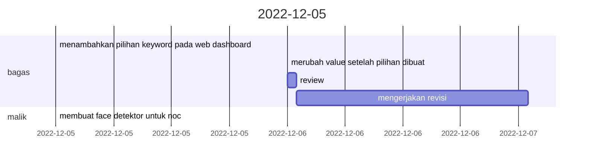
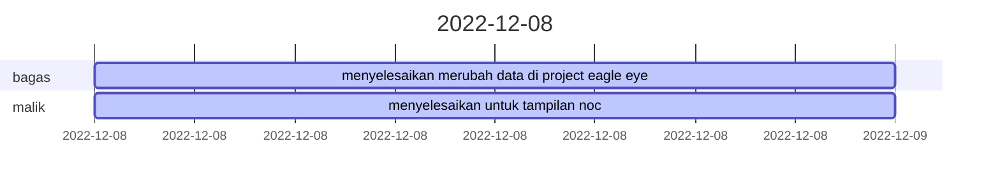
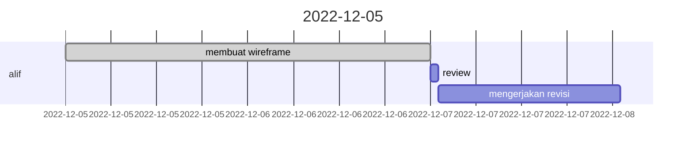
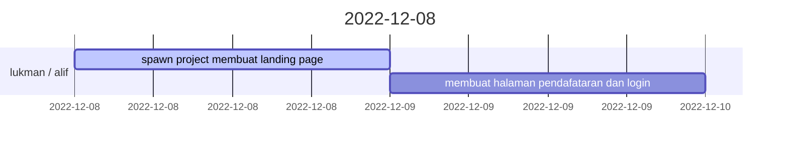

|  Mon  |  Tue  |  Wed  |  Thu  |  Fri  |  Sat  |  Sun  |
| :---: | :---: | :---: | :---: | :---: | :---: | :---: |
|  28   |  29   |  30   |   1   |   2   |   3   |   4   |
|   5   |   6   |   7   |   8   |   9   |  10   |  11   |
|  12   |  13   |  14   |  15   |  16   |  17   |  18   |
|  19   |  20   |  21   |  22   |  23   |  24   |  25   |
|  26   |  27   |  28   |  29   |  30   |  31   |   1   |

> # Eagle Eye View

### Team
| No  | Name  |
| --- | ----- |
| 1   | Malik |
| 2   | Bagas |

> # Muku

### Team

| No  | Name |
| --- | ---- |
| 1   | Alif |

